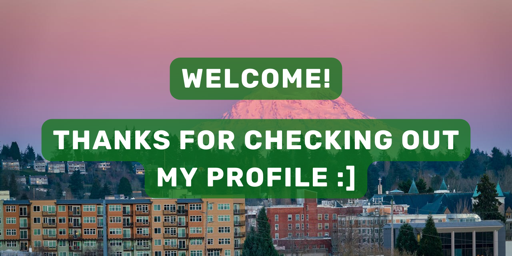

```
- 🌱 I’m currently working as a Summer Intern at Hack Club.

- 💬 Ask me about Figma, Git, GitHub, HTML5, and CSS3.

- 📫 You can reach me in the ways detailed in the "Connect with Me" section of this repo.

- ⚡ In my free time, I love to taking public transit, listening to music, or hanging out on Slack.
```

<!-- - 📝 I regularly ... -->
<!-- - 🔭 I’m currently working on a project. -->
<!-- - 👯 I’m looking to collaborate on ... -->
<!-- - 🤔 I’m looking for help with ... -->
<!-- - 👨‍💻 All of my projects are available [in my portfolio](portfolio link) -->
<!-- - 📄 Know about my experiences [in my resume](resume link) -->
<!-- Sort with https://rahuldkjain.github.io/gh-profile-readme-generator/ -->

<details>
  <summary><b>Languages, Tools, and Frameworks</b></summary>
  
  
  
  
  
  <!-- use https://github.com/Ileriayo/markdown-badges -->
</details>

<details>
  <summary><b>Stats and Streaks</b></summary>
  
  
  
</details>

<details>
  <summary><b>Achievements and Awards</b></summary>
  
</details>

<details>
  <summary><b>Connect with Me</b></summary>
  <p>I would prefer to be sent a DM on the Hack Club Slack. If you don't have access, you can also message me LinkedIn, or comment in the discussions tab of this repo - I should respond within 24 hours 🙂</p>
</details>
